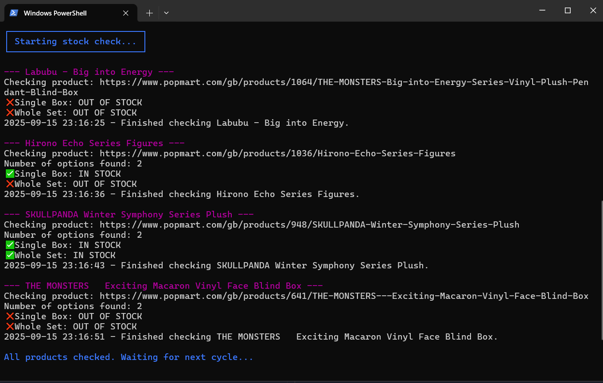

# Playwright Auto Checker           


A Python automation tool that monitors product stock on e-commerce sites using Playwright
. When selected product options become available, it sends real-time SMS notifications.

This project is currently tailored for Pop Mart, where it checks the availability of Single Box and Whole Set options. Stock status is determined by detecting whether product options are styled with a line-through (indicating they are out of stock). 

---
## Table of Contents

<!-- vscode-markdown-toc -->
* 1. [Project Status](#ProjectStatus)
* 2. [Tech Used](#TechUsed)
* 3. [Features](#Features)
* 4. [Project Structure](#ProjectStructure)
* 5. [Demo](#Demo)
* 6. [Scripts Overview](#ScriptsOverview)
* 7. [Installation](#Installation)
* 8. [Usage](#Usage)
* 9. [Configure SMS](#ConfigureSMS)
* 10. [Roadmap](#Roadmap)
* 11. [License](#License)

<!-- vscode-markdown-toc-config
	numbering=true
	autoSave=true
	/vscode-markdown-toc-config -->
<!-- /vscode-markdown-toc -->

##  1. <a name='ProjectStatus'></a>Project Status

**Current Version:** `0.1.0` (Alpha)

This release is functional on local machines and demonstrates the core features of the project.  
Headless support and deployment testing on Raspberry Pi are not yet implemented.  

Planned improvements:
- Add headless mode for Raspberry Pi deployment.
- Expand automated testing.
- Refine documentation and usage examples.

---
##  2. <a name='TechUsed'></a>Tech Used

- Python 3.11
- Twilio API (SMS alerts)
- [Playwright](https://playwright.dev/) (browser automation for monitoring stock availability)
- python-dotenv (manage environment variables securely)
- JSON (simple local persistence for stock tracking)
- Git & GitHub (version control)
---


##  3. <a name='Features'></a>Features  

- ✅ Automatically check multiple product URLs  
- ✅ Detect whether product options are **in stock** or **out of stock**  
- ✅ Return clean boolean output for easy automation  
- ✅ Send SMS alerts when desired items are available  
- ✅ Store and track stock status using JSON to avoid duplicate notifications  
- ✅ Auto-add items to cart (experimental)  
- ✅ Designed to run on a local machine or Raspberry Pi


---

##  4. <a name='ProjectStructure'></a>Project Structure  

```
.

├── .gitignore                  # Ignore virtual env, .env, etc.
├── .env                        # Local environment variables (Twilio keys, phone number)
├── config.py                   # Imports env variables for scripts
├── app.py                       # Main entry point to run product checks
├── requirements.txt             # Python dependencies
├── README.md                    # Project documentation
└── scripts/                     # All individual scripts
    ├── line_through_check.py    # Core stock checker script
    ├── detect_stock.py          # Optional/legacy stock checking
    └── send_sms.py              # Sends SMS notifications for in-stock items

```

##  5. <a name='Demo'></a>Demo

Here’s a screenshot of the app in action:




---

##  6. <a name='ScriptsOverview'></a>Scripts Overview  

- **`app.py`**  
  Main entry point. Iterates through a list of product URLs and prints stock availability for each.  

- **`scripts/line_through_check.py`**  
  Core stock checker. Contains the `check_stock()` function that returns a dictionary of `{option: bool}` (e.g., `{"Single Box": True, "Whole Set": False}`).  

- **Other experimental scripts** *(optional)*  
  You may still have older scripts like `detect_stock.py` or `check_options.py` in the repo. These were early tests and can be cleaned up later. The main production-ready script is `line_through_check.py`.  

---

##  7. <a name='Installation'></a>Installation  

1. Clone the repository:  
   ```bash
   git clone https://github.com/nievyx/playwright-auto-checker.git
   cd project-name
   ```

2. Set up a virtual environment (optional but recommended):  
   ```bash
   python -m venv venv
   source venv/bin/activate   # Mac/Linux
   venv\Scripts\activate      # Windows
   ```

3. Install dependencies:  
   ```bash
   pip install -r requirements.txt
   playwright install
   ```

---

##  8. <a name='Usage'></a>Usage  

Run a stock check on a single product:  
```bash
python scripts/line_through_check.py
```

Or run checks on multiple products with:  
```bash
python app.py
```

Example output:  
```
Checking product: https://www.<example>.com/gb/products/1036/<example>-Echo-Series-Figures
Single Box: IN STOCK
Whole Set: OUT OF STOCK
```
##  9. <a name='ConfigureSMS:'></a>Configure SMS:
Create a .env file (local only)
```
TWILIO_ACCOUNT_SID=your_account_sid_here
TWILIO_AUTH_TOKEN=your_auth_token_here
TWILIO_PHONE_NUMBER=+1234567890
MY_PHONE_NUMBER=+0987654321
```
---

##  10. <a name='Roadmap'></a>Roadmap  

- [ ] Tailor application to run headlessly on systems like Raspberry Pi and local machines
- [ ] Add Discord as message option


---

##  11. <a name='License'></a>License  

MIT License


Copyright (c) 2025 Nievyx


See LICENSE file for details.